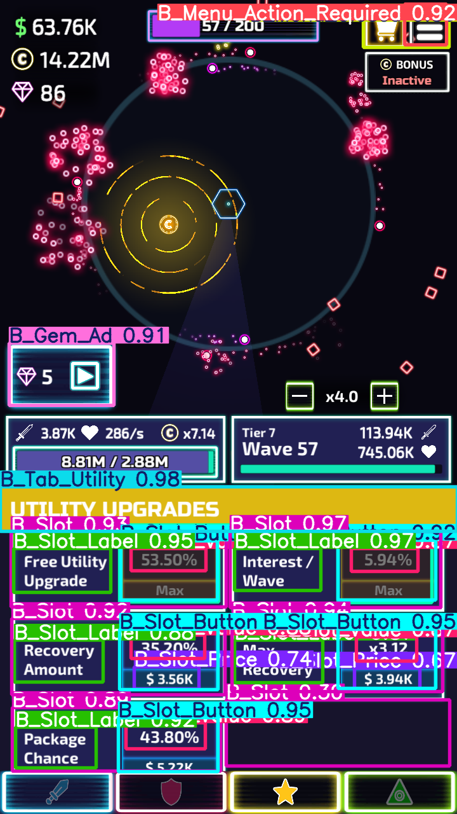

# State detection using YOLO 11n
The UI constantly changes just a little bit. 
This makes it very tedious to keep a consistent state detection mechanism.
Using object detection we will kill this problem with a very big stone.

Currently the installation process is wonky. If you want to train it on your computer,
you probably have to fix the imports for your system first.

You can start the labeler with the startLabeler.sh.
The account in label-studio is test@test.de and with test as password I think.

The exported annotated data is in data_yolo. But the rich annotations are berried somewhere in label-studio.

## Example
